# CYD MIDI Controller - Enhanced Edition

Advanced touchscreen Bluetooth MIDI controller for the ESP32-2432S028R "Cheap Yellow Display" (CYD).

> **Note**: This is a heavily modified fork of [NickCulbertson/CYD-MIDI-Controller](https://github.com/NickCulbertson/CYD-MIDI-Controller). We've significantly enhanced the UI/UX with larger touch targets, improved layouts, and better touch accuracy for capacitive touchscreens.

## Screenshots

> **Note**: Screenshots are captured as BMP files (compatible with SD card storage on the device). GitHub doesn't render BMP files, but you can view them by cloning the repo or checking the [assets/screenshots](assets/screenshots/) folder.

<div align="center">
  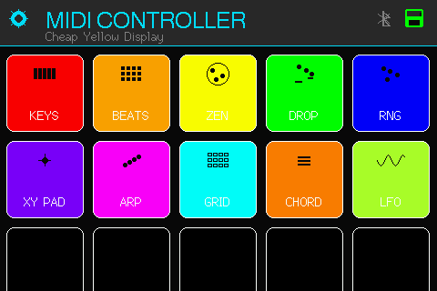
  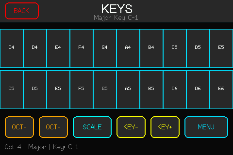
</div>

<details>
<summary>📸 View All Mode Screenshots (15 Modes)</summary>

### Menu & System
<div align="center">
  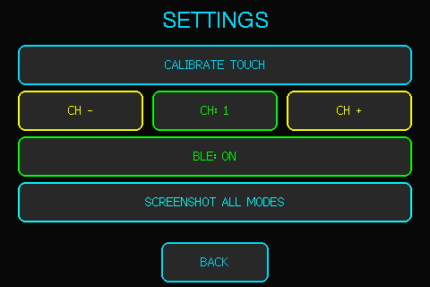<br>
  <em>Settings Menu - Calibration, MIDI, BLE, Screenshots</em>
  
  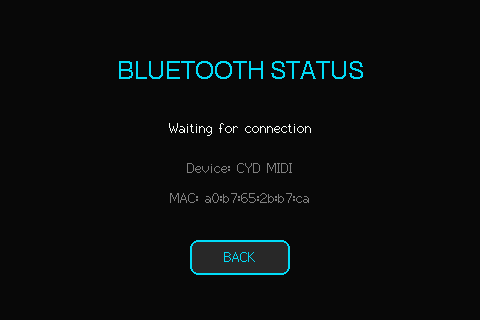<br>
  <em>Bluetooth Status - Connection & MAC Address</em>
</div>

### Original 10 Modes
<div align="center">
  <br>
  <em>Virtual Keyboard - Scales & Key Selection</em>
  
  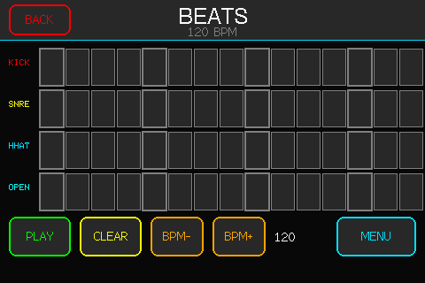<br>
  <em>16-Step Sequencer - 4 Tracks</em>
  
  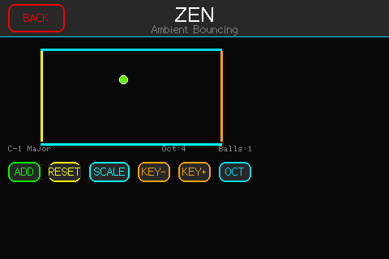<br>
  <em>Bouncing Ball - Generative Ambient</em>
  
  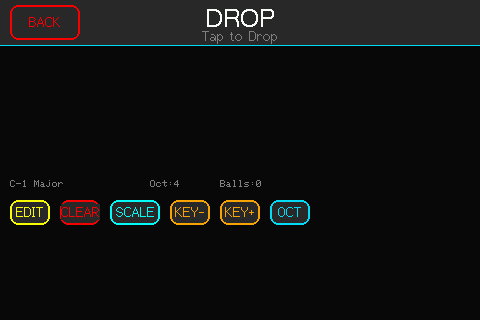<br>
  <em>Physics Drop - Gravity Simulation</em>
  
  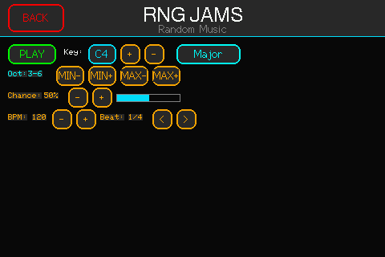<br>
  <em>Random Generator - Controlled Chaos</em>
  
  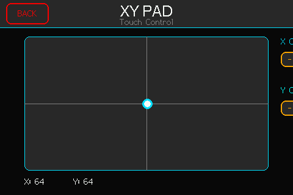<br>
  <em>XY Pad - Real-time Expression</em>
  
  <br>
  <em>Arpeggiator - Chord Patterns</em>
  
  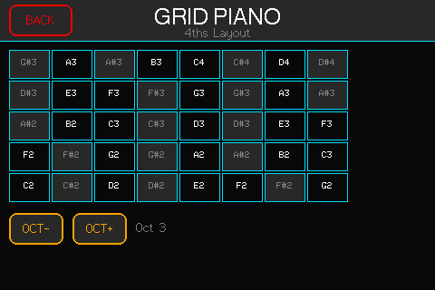<br>
  <em>Grid Piano - 4ths Layout</em>
  
  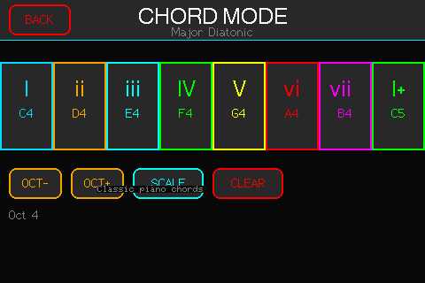<br>
  <em>Auto Chord - Diatonic Progressions</em>
  
  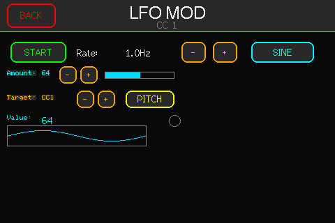<br>
  <em>LFO Modulator - Waveform Control</em>
</div>

### New Advanced Modes
<div align="center">
  <br>
  <em>TB3PO 😊 - Acid Bassline Generator</em>
  
  <br>
  <em>GRIDS ◉ - Euclidean Drum Sequencer</em>
  
  <br>
  <em>RAGA 🎵 - Indian Classical Music</em>
  
  <br>
  <em>EUCLID ◯ - Mathematical Rhythms</em>
  
  <br>
  <em>MORPH ∞ - Gesture Synthesis</em>
</div>

</details>

## Credits

- **Original Project**: [NickCulbertson/CYD-MIDI-Controller](https://github.com/NickCulbertson/CYD-MIDI-Controller)
- **Hardware Resources**: Brian Lough's [ESP32-Cheap-Yellow-Display](https://github.com/witnessmenow/ESP32-Cheap-Yellow-Display) repo

## Features

### 15 Interactive Modes

#### Original Modes
- **KEYS** - Virtual piano keyboard with scale and key controls
- **BEATS** - 16-step sequencer with 4 tracks and tempo control
- **ZEN** - Ambient bouncing ball mode for generative music
- **DROP** - Physics-based ball drop with customizable platforms
- **RNG** - Random music generator for creative exploration
- **XY PAD** - Touch-controlled X/Y pad for real-time parameter control
- **ARP** - Arpeggiator with chord-based patterns
- **GRID** - Grid piano with 4ths layout for unique playing style
- **CHORD** - Auto-chord mode with diatonic chord progressions
- **LFO** - Low-frequency oscillator for modulation effects

#### New Advanced Modes
- **TB3PO** 😊 - Acid bassline generator inspired by the TB-303 with probabilistic sequencing
- **GRIDS** ◉ - Euclidean drum sequencer based on Mutable Instruments Grids topology
- **RAGA** 🎵 - Indian classical music mode with authentic ragas and microtonal support
- **EUCLID** ◯ - Pure Euclidean rhythm generator with mathematical pattern distribution
- **MORPH** ∞ - Gesture-based morphing synthesizer for expressive performance

### Core Features

- **Bluetooth MIDI** - Wireless connection to DAWs and music software
- **WiFi Web Server** - Remote file management and screenshot capture via web browser
- **Enhanced Touch UI** - Enlarged buttons (60-80px) and optimized layouts for capacitive touchscreens
- **Accurate Touch Detection** - Fixed coordinate mismatches between visual and touch layers
- **Real-time Control** - Low-latency MIDI output with configurable MIDI channels
- **Visual Feedback** - Responsive graphics with status icons (BLE, SD card, BPM display)
- **Screenshot Capture** - Save all mode screens to SD card or download via web interface
- **Persistent WiFi Config** - Store WiFi credentials on SD card for automatic connection
## What You Need

### Supported Hardware

- **CYD 3.5" (ESP32-3248S035)** - 480×320 ILI9488 - *Recommended* ✓
- **CYD 2.8" (ESP32-2432S028R)** - 320×240 ILI9341
- **CYD 2.4" (ESP32-2432S024)** - 320×240 ILI9341

All boards available for ~$15 from AliExpress/Amazon

### Additional

- **MicroSD Card** (optional) - For screenshot capture, WiFi config storage, and web file management
- **PlatformIO** or **Arduino IDE** with ESP32 support
- **WiFi Network** (optional) - For web server and remote control features

### Recent Enhancements

- ✅ **Larger touch targets** - Minimum 45px buttons for better accuracy
- ✅ **Fixed touch detection** - Resolved Y-coordinate mismatches in all modes
- ✅ **Improved layouts** - Settings menu, Grid Piano (45×32 cells), Auto Chord, Arpeggiator
- ✅ **Better spacing** - No overlapping buttons, optimized for 480×320 display
- ✅ **Header icons** - BLE status, SD card indicator, and BPM display on main menu
- ✅ **MIDI channel support** - Configurable per-session MIDI channels (1-16)
- ✅ **Expanded flash memory** - 3.1MB app partition for advanced features
- ✅ **5 new advanced modes** - TB3PO, Grids, Raga, Euclidean, Morph
- ✅ **Web server** - Remote file management and screenshot downloads
- ✅ **WiFi persistence** - Store network credentials on SD card

## Installation

### Option A: PlatformIO (Recommended)

#### 1. Install PlatformIO

**VS Code Method (Easiest):**
1. Install [Visual Studio Code](https://code.visualstudio.com/)
2. Open VS Code and go to Extensions (Ctrl+Shift+X / Cmd+Shift+X)
3. Search for "PlatformIO IDE" and install it
4. Reload VS Code when prompted

**Command Line Method:**
```bash
# macOS/Linux
pip install platformio

# Or via Homebrew (macOS)
brew install platformio
```

#### 2. Clone and Open Project

```bash
git clone https://github.com/julesdg6/CYD-MIDI-Controller-EE.git
cd CYD-MIDI-Controller-EE
```

Then open the folder in VS Code with PlatformIO installed.

#### 3. Install USB Drivers

**Before uploading**, ensure you have the correct USB-to-serial drivers installed:

- **CP210x (Silicon Labs)** - Most common for CYD boards
  - Download: [Silicon Labs CP210x Drivers](https://www.silabs.com/developers/usb-to-uart-bridge-vcp-drivers)
  - macOS: Install the `.dmg` and restart
  - Windows: Run the installer executable
  - Linux: Usually pre-installed (module: `cp210x`)

- **CH340/CH341 (WCH)** - Alternative chip used on some boards
  - Download: [WCH CH340 Drivers](http://www.wch-ic.com/downloads/CH341SER_EXE.html)
  - macOS: May require allowing in System Preferences → Security & Privacy
  - Windows: Run installer as administrator
  - Linux: Usually pre-installed (module: `ch341`)

**Verify driver installation:**
```bash
# macOS/Linux - You should see a device like:
ls /dev/cu.* /dev/tty*
# Look for: /dev/cu.usbserial-* or /dev/cu.SLAB_USBtoUART or /dev/ttyUSB0

# Windows - Check Device Manager under "Ports (COM & LPT)"
# Look for: COM3, COM4, etc. with "USB Serial Port" or "CH340"
```

#### 4. Select Your Board

Edit `platformio.ini` and uncomment the line for your CYD model:

```ini
[platformio]
default_envs = cyd35   ; 3.5" display (480×320) - Default
;default_envs = cyd28  ; 2.8" display (320×240)
;default_envs = cyd24  ; 2.4" display (320×240)
```

#### 5. Build and Upload

**Using VS Code:**
1. Connect your CYD board via USB
2. Click the **checkmark (✓)** icon in the bottom toolbar to build
3. Click the **right arrow (→)** icon to upload
4. Monitor output with the **plug icon** for serial monitor

**Using Command Line:**
```bash
# Build only (compile without uploading)
pio run -e cyd35

# Upload to board (auto-detects port)
pio run -t upload -e cyd35

# Upload with specific port
pio run -t upload -e cyd35 --upload-port /dev/cu.SLAB_USBtoUART

# Open serial monitor after upload
pio device monitor -b 115200
```

#### 6. Upload Speed Configuration

If uploads **fail or timeout**, try reducing the upload speed in `platformio.ini`:

```ini
[env:cyd35]
upload_speed = 115200  ; Add this line (default is usually 921600)
```

Common working speeds: `115200`, `230400`, `460800`, `921600`

#### 7. Troubleshooting PlatformIO Uploads

**"Serial port not found" or "Device not connected"**
- Check USB cable (use a data cable, not charge-only)
- Verify drivers are installed (see Step 3)
- Try a different USB port (USB 2.0 ports often work better)
- Check `dmesg` (Linux) or `system_profiler SPUSBDataType` (macOS) after plugging in

**"Failed to connect to ESP32"**
- **Hold BOOT button** during upload (release after "Connecting..." appears)
- Some CYD boards require manual boot mode entry:
  1. Hold **BOOT** button
  2. Press and release **RST** (reset) button
  3. Release **BOOT** button
  4. Start upload immediately
- Try reducing upload speed to `115200` (see Step 6)
- Check if another program is using the serial port (close Arduino IDE, screen, minicom)

**"Timed out waiting for packet header" or "Failed to enter bootloader"**
- Add this to `platformio.ini` under your `[env:cyd35]` section:
  ```ini
  upload_speed = 115200
  upload_resetmethod = nodemcu
  ```
- Or try: `upload_resetmethod = ck` or `upload_resetmethod = wifio`

**ESP32-S3 Specific Issues** (If you have an ESP32-S3 variant)
- ESP32-S3 boards may have **two USB ports**: one for programming, one for UART
  - Use the port labeled "USB" or "UART" for uploading
  - If unclear, try both ports
- ESP32-S3 requires entering boot mode differently:
  1. Hold **BOOT** (GPIO0) button
  2. Press **RST** button briefly
  3. Release **BOOT** after 1-2 seconds
  4. Device should appear as serial port, then upload
- For ESP32-S3 with **native USB CDC**, add to `platformio.ini`:
  ```ini
  board = esp32-s3-devkitc-1
  board_build.mcu = esp32s3
  board_build.f_cpu = 240000000L
  upload_speed = 115200
  ```

**Permission denied (Linux/macOS)**
- Linux: Add user to `dialout` group:
  ```bash
  sudo usermod -a -G dialout $USER
  # Log out and back in
  ```
- macOS: Grant Terminal/VS Code permissions in System Preferences → Security & Privacy → Full Disk Access

**"Flash size mismatch" or "Partition table errors"**
- The project uses `huge_app.csv` partition scheme (3.1MB app partition)
- Ensure `board_build.partitions = huge_app.csv` is in `platformio.ini`
- Some boards may need `board_upload.flash_size = 4MB` explicitly set

**Build succeeds but upload hangs at "Connecting..."**
- Unplug and replug USB cable
- Try holding BOOT button during entire upload process
- Check for hardware issues (faulty USB cable, damaged port)
- Use powered USB hub if board draws significant current

**Still having issues?**
- Clean build: `pio run --target clean && pio run`
- Check serial monitor output: `pio device monitor -b 115200`
- Verify correct board selection in `platformio.ini`
- Post complete error output to GitHub issues with board model and OS

### Option B: Arduino IDE

#### 1. Add ESP32 Board Support

1. Go to `File` → `Preferences`
2. Add to "Additional Boards Manager URLs":
   ```
   https://espressif.github.io/arduino-esp32/package_esp32_index.json
   ```
3. Go to `Tools` → `Board` → `Boards Manager`
4. Search "ESP32" and install "ESP32 by Espressif Systems"

#### 2. Install Libraries
In Arduino IDE Library Manager, install:
- `TFT_eSPI` by Bodmer
- `XPT2046_Touchscreen` by Paul Stoffregen

#### 3. Configure TFT_eSPI

Replace the `libraries/TFT_eSPI/User_Setup.h` with the `User_Setup.h` from the repo.

#### 4. Upload Code
1. Clone this repo and open `CYD_MIDI_Controller.ino`
2. Select board: `ESP32 Dev Module`
3. Connect CYD and upload
(Lower Upload Speed to `115200` if the sketch isn't uploading)

## Usage

### First Run - Touch Calibration

### Settings Menu

Access via the cog icon in the main menu:
- **Calibrate Touch** - Recalibrate touchscreen coordinates
- **MIDI Channel** - Change MIDI channel (1-16)
- **BLE Toggle** - Enable/disable Bluetooth advertising
- **Screenshot Mode** - Cycle through all 15 modes and save screenshots to SD card
- **Web Server** - Automatically starts on WiFi connection (configurable via SD card)

### Web Server Interface

Access at `http://[device-ip]` when connected to WiFi:
- **File Browser** - Navigate SD card directories, upload/download/delete files
- **Screenshot Capture** - Take instant screenshots via `/screenshot` endpoint
- **WiFi Configuration** - Save network credentials to `/wifi_config.txt` for automatic connection
- **Directory Navigation** - Full filesystem access with breadcrumb navigation

## Troubleshooting

### Upload & Connection Issues
- **Upload fails**: See detailed [PlatformIO Troubleshooting](#7-troubleshooting-platformio-uploads) section above
- **Serial port not found**: Install USB drivers (CP210x or CH340) - see [Installation → Option A → Step 3](#3-install-usb-drivers)
- **ESP32-S3 connection issues**: Check [ESP32-S3 Specific Issues](#7-troubleshooting-platformio-uploads) in PlatformIO section

### Hardware & Display
- **Blank screen**: Check TFT_eSPI pin configuration matches `User_Setup.h`
- **Touch not responding**: Verify XPT2046_Touchscreen library is installed
- **Touch accuracy issues**: Run touchscreen calibration from Settings menu

### Connectivity
- **Bluetooth not pairing**: Toggle BLE off/on in Settings, restart device
- **SD card not detected**: Ensure FAT32 formatted card is properly inserted
- **WiFi not connecting**: Create `/wifi_config.txt` on SD card with SSID on line 1, password on line 2
- **Web server not accessible**: Check device IP address on serial monitor or connect to AP mode "CYD-MIDI" (password: midi1234)
- **Screenshots failing**: Ensure SD card has sufficient space and `/screenshots/` directory exists

## Development

### Building from Source

```bash
# Using PlatformIO
pio run -e cyd35

# Upload to device
pio run -t upload -e cyd35
```

### Project Structure

```
src/
├── CYD-MIDI-Controller.ino  # Main file
├── common_definitions.h      # Shared constants
├── ui_elements.h             # UI helper functions
├── midi_utils.h              # MIDI communication
└── *_mode.h                  # Individual mode implementations
```

## Connecting to Your DAW

1. Pair "CYD MIDI" via Bluetooth
2. Select as MIDI input in your DAW (e.g., Ableton Live, FL Studio, Logic Pro)
3. All MIDI modes send on the configured channel (default: Channel 1)
4. Use Settings menu to change MIDI channel if needed

## Contributing

Contributions welcome! This project has diverged significantly from the original, focusing on improved UX for capacitive touchscreens.

## License

Open source - see MIT license file for details.
